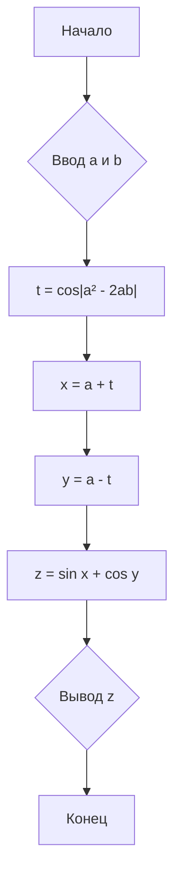
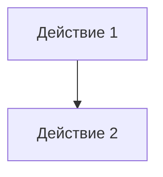
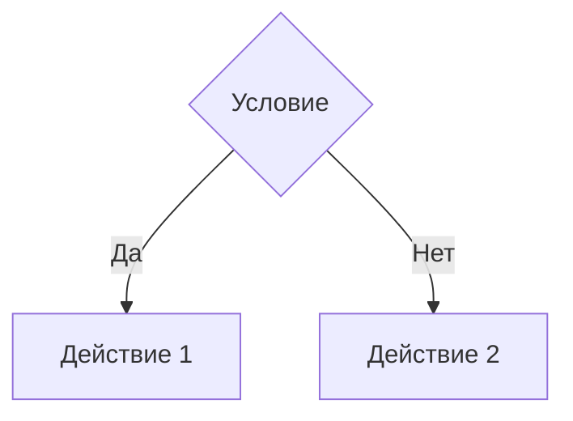
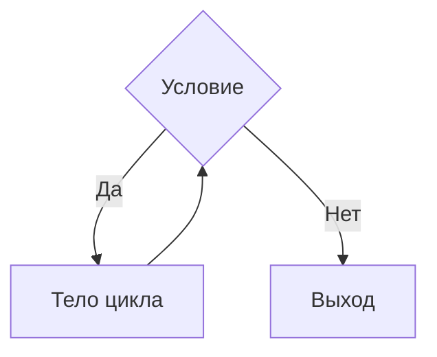
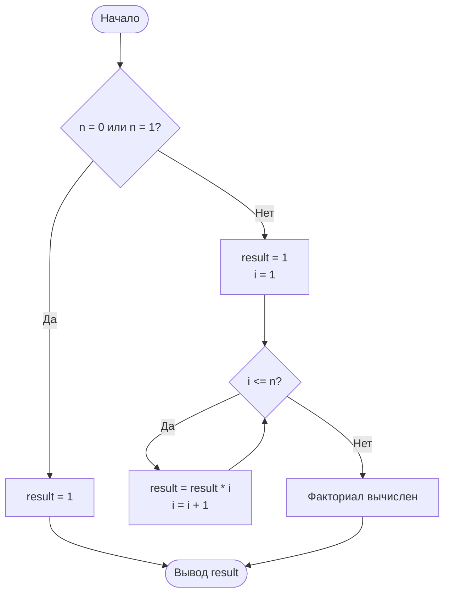

# Алгоритм и его свойства
## Понятие алгоритма
**Алгоритмом** называется строго определенная последовательность действий, определяющих процесс перехода от исходных данных к искомому результату.
Развитие теории алгоритмов начинается с доказательства Куртом Гёделем теорем о неполноте формальных систем, включающих арифметику, первая из которых была доказана в 1931. Возникшее в связи с этими теоремами предположение о невозможности алгоритмического разрешения многих математических проблем вызвало необходимость стандартизации понятия алгоритма. Первые стандартизованные варианты этого понятия были разработаны в 30-х годах XX века в работах А. Тьюринга, А. Чёрча и Э. Поста.
Предложенные ими машина Тьюринга, машина Поста и лямбда-исчисление Чёрча оказались эквивалентными друг другу. Основываясь на работах Гёделя, С. Клини ввел понятие рекурсивной функции, также оказавшееся эквивалентным вышеперечисленным.

В настоящее время теория алгоритмов развивается, главным образом, по трем направлениям. Классическая теория алгоритмов изучает проблемы формулировки задач в терминах формальных языков, вводит понятие задачи разрешения, проводит классификацию задач по классам сложности и др. Теория асимптотического анализа алгоритмов рассматривает методы получения асимптотических оценок ресурсоемкости или времени выполнения алгоритмов, в частности, для рекурсивных алгоритмов. Асимптотический анализ позволяет оценить рост потребности алгоритма в ресурсах (например, времени выполнения) с увеличением объема входных данных. Теория практического анализа вычислительных алгоритмов решает задачи получения явных функции трудоёмкости, интервального анализа функций, поиска практических критериев качества алгоритмов, разработки методики выбора рациональных алгоритмов.

Примером алгоритма может служить алгоритм решения задачи "Переправа с волком" или "Волк, коза и капуста".
>Однажды крестьянину понадобилось перевезти через реку волка, козу и капусту. У крестьянина есть лодка, в которой может поместиться, кроме самого крестьянина, только один объект – или волк, или коза, или капуста. Если крестьянин оставит без присмотра волка с козой, то волк съест козу; если крестьянин оставит без присмотра козу с капустой, коза съест капусту. В присутствии же крестьянина «никто никого не ест».

![[Pasted image 20251105134053.png]]
**Решение**
Обозначим волка, козу и капусту за `В`, `К`, `Кап`. Переезд на правый берег `→`, переезд на левый берег `←`. Тогда алгоритм можно представить следующим образом:

|  #  |  →  |  ←  |    Результат     |
| :-: | :-: | :-: | :--------------: |
|  0  |  –  |  –  | В К Кап \| ~~ \| |
|  1  |  К  |  –  | В Кап \| ~~ \| К |
|  2  | Кап |  К  | В К \| ~~ \| Кап |
|  3  |  В  |  –  | Кап \| ~~ \| В К |
|  4  | Кап |  –  | \| ~~ \| В К Кап |
## Свойства алгоритма
Порядок действий считается алгоритмом в том случае, если он обладает определенными свойствами.
**Дискретность**
Алгоритм должен представлять процесс решения задачи как последовательность выполнения простых действий (шагов, этапов). При этом для выполнения каждого действия алгоритма требуется время.

**Детерминированность (Однозначность)**
Каждое действие (шаг, этап) должно быть четким, однозначным, исключающим произвольное толкование и не оставляющим места для двусмысленности. Выполнение алгоритма носит, по сути, механический характер и не требует никаких дополнительных указаний.

**Результативность**
Алгоритм должен приводить к решению задачи или сообщению, что задача решений не имеет за конечное число шагов.

**Конечность**
Каждое отдельное действие, как и весь алгоритм должны иметь возможность реального исполнения. Поэтому алгоритм имеет придел, т. е. конечен.

**Массовость**
Алгоритм разрабатывается в общем виде так, чтобы его можно было применять для класса задач, различающихся только исходными данными. При этом исходные данные выбираются из некоторой области, которая называется областью применяемости алгоритма. Например, для решения квадратного уравнения $ax 2 +bx+c=0$, коэффициенты действительные числа, а ≠ 0, и а, в, с – различные.

Пример из жизни: рецепт приготовления бутерброда.
1. Взять ломтик хлеба.
2. Намазать на него масло.
3. Положить сверху ломтик сыра.
4. Готово.

Это алгоритм. Он корректен, но не идеален. Что, если хлеба нет? Что, если масло твердое? Хороший алгоритм должен учитывать различные случаи.
### Способы записи алгоритмов
Существуют разные способы записи алгоритмов:
- словесно-формульный;
- графический (блок-схема);
- псевдокод (алгоритмические языки).
### Словесно-формульный способ
Для исполнителя - человека алгоритм может быть представлен предложениями обычного текста с использованием в случае необходимости математической или другой символики.
Словесно-формульный способ. Например, требуется решить квадратное уравнение $ax^2 + bx + c = 0$ в области действительных чисел. Математической моделью этой задачи является известная формула корней квадратного уравнения: $$y_{1,2} = \frac{-b \pm \sqrt{b^2 - 4ac}}{2a}$$
На основании этой формулы запишем алгоритм:
1. Задать значения $а, b, c$.
2. Вычислить дискриминант $d = b^2 – 4ac$.
3. Сравнить дискриминант с нулем, если он больше нуля, то вычислить корни по формуле $y_{1,2} = \frac{-b \pm \sqrt{d}}{2a}$ и перейти к п. 4, иначе сообщить: «В области действительных чисел уравнение решений не имеет».
4. Записать результат: «Корни уравнения $у_1$ и $у_2$».
### Графический
Графический способ описания алгоритма иначе называют блок-схемой.
**Блок-схема** – это графическое изображение алгоритма в виде схемы связанных между собой с помощью линий перехода *блоков* – специальных графических объектов, каждый из которых соответствует определенным шагам алгоритма.
Внутри блока дается описание соответствующих действий. Блоки, как правило, располагаются сверху вниз. Линии соединения отдельных блоков показывают направление процесса обработки в схеме. Стрелку можно не указывать при направлении дуги слева направо и сверху вниз. Линии должны подходить к символу слева, либо сверху, а исходить снизу, либо справа.
В России блок-схемы регламентируются **ГОСТ 19.701-90** «Схемы алгоритмов, программ, данных и систем. Условные обозначения и правила выполнения». Этот стандарт устанавливает единые условные обозначения (символы) и правила их применения для отображения различных задач обработки данных.

Давайте рассмотри наиболее употребляемые блоки.
![[Pasted image 20251105144541.png]]
**Пример**
Задавая $a$ и $b$, вычислить значения функции $z = \sin x + \cos y$, где $x = a + \cos|a^2 - 2ab|$, $y = a - \cos|a^2 - 2ab|$.

### Псевдокод
Алгоритм – это задание для исполнителя. Исполнитель выполняет алгоритм, т. е. делает то, что написано в алгоритме. Если исполнитель точно выполнит то, что написано в алгоритме, то он получит результат.
Для этого алгоритмы описываются с помощью специально для этого созданных формальных языках, которые называют **алгоритмическими** или **языками программирования**. Такую запись алгоритма называют **программой**.
Попробуем решить предыдущую задачу с помощью Python.
```python
import math  
  
a = float(input("Введите значение a: "))
b = float(input("Введите значение b: "))  
  
t = math.cos(abs(a**2 - 2*a*b))

x = a + t  
y = a - t

z = math.sin(x) + math.cos(y)

print(f"Результат {z = }")
```
## Типы алгоритмов
Существуют три основные разновидности алгоритмических действий, сочетанием которых можно описать любой алгоритм:
- линейные;
- разветвляющиеся;
- циклические.
### Линейные
**Линейный алгоритм** – это алгоритм, в котором действия выполняются только один раз и строго в том порядке, в котором они записаны. На блок-схеме ему соответствует несколько расположенных друг за другом блоков обработки и/или блоков ввода-вывода.

### Разветвляющиеся
**Разветвляющийся алгоритм** – это алгоритм, в котором то или иное действие выполняется после анализа условия. Процесс анализа условия и выбора одной из ветвей на блок-схеме показывают с помощью логического *блока выбора*.
Результатом проверки может быть один из двух исходов: условие выполнено `Да` или условие не выполнено `Нет`. Каждому из этих исходов могут соответствовать некоторые действия или отсутствие каких-либо действий для одного из исходов. Обычно условие формулируется в виде логического выражения, вычисление которого в зависимости от результатов предшествующих действий дает значение **истина** или **ложь**.

### Циклические
**Циклический алгоритм (цикл)** – это алгоритм, в котором группа операторов выполняется несколько раз подряд.
Выполняется циклический алгоритм так: сначала проверяется условие, если условие верно (истина), то выполняется тело цикла (действия или группа операторов) и, далее, изменяются значения параметра цикла и снова проверяется условие и т.д. На каком-то шаге условие не выполнится (ложь) и тогда происходит выход из цикла и продолжается выполнение программы.

## Рекурсивные
Отдельно можно выделить такой тип алгоритма как **рекурсивный**. В отличие от линейных, разветвляющихся или циклических конструкций, которые описывают поток выполнения в рамках одного экземпляра процедуры, рекурсия вводит концепцию самоподобия и вложенности вычислительных процессов.
**Рекурсивным** – алгоритм, организованный таким образом, что в процессе выполнения команд на каком-либо шаге он прямо или косвенно *обращается сам к себе*.
Из курса математического анализа вы должны знать, что рекурсивный алгоритм строится на двух столпах.
Первый – это базовый случай или **базис**, который представляет собой простейший сценарий, решаемый непосредственно, без последующих рекурсивных обращений. Он служит критически важным условием остановки, предотвращающим бесконечную цепочку вызовов. Отсутствие или некорректное определение базового случая неминуемо приводит к исчерпанию системных ресурсов, в частности, переполнению стека вызовов, поскольку каждая рекурсивная процедура требует выделения памяти для своих локальных переменных и контекста выполнения.
Второй столп – **рекурсивный шаг**. На этом этапе алгоритм вызывает сам себя, но с измененным, как правило, упрощенным или уменьшенным набором входных данных. Ключевое требование к этому шагу – неуклонное приближение к базовому случаю. Параметры, с которыми происходит рекурсивный вызов, должны изменяться таким образом, чтобы после конечного числа шагов обязательно было достигнуто условие остановки.
### Алгоритм нахождения факториала
Яркий пример рекурсивного алгоритма – алгоритм нахождения факториала.
**Факториал** – это математическая функция, определяемая как произведение всех положительных целых чисел от $1$ до данного числа $n$. Обозначается $n!$ и вычисляется по формуле: $$n! = 1 * 2 * 3 * ... * n$$
Сам алгоритм основан на математическом свойстве факториала: $n! = n * (n - 1)!$, с базовым случаем $0! = 1$.
Алгоритм проверяет, достигнут ли базовый случай $n = 0$. Если да – возвращает $1$. Если нет – выполняет рекурсивный вызов для вычисления факториала $n-1$ и умножает результат на $n$.

# Алгебра логики
Для того, что правильно составлять логические выражения для разветвляющихся, циклических и рекурсивных алгоритмов необходимо понимать как работают логические высказывания.

**Логика** – это наука о законах и формах мышления, математическая же логика занимается применением формальных математических методов для решения логических задач. В цифровых устройствах чрезвычайно широко используется простейший раздел математической логики – исчисление высказываний или алгебра логики.
**Алгебру логики** часто называют **булевой алгеброй** в честь английского математика Джорджа Буля, который в 1847 году опубликовал краткую брошюру «Математический анализ логики, сопровождаемый наброском исчисления дедуктивных рассуждений», а в 1854 году вышел его основной труд «Исследование законов, на которых основаны математические теории логики и вероятностей».
**Алгебра логики** – раздел математической логики, в котором изучаются логические операции над высказываниями.
**Пример**: предложение «6 - четное число» является высказыванием, т.к. оно истинное.

Существуют предложения, в которых для выяснения истинности или ложности требуются дополнительные сведения. Такие предложения являются высказывательными формами.
**Высказывательная форма** - повествовательное предложение, которое прямо или косвенно содержит хотя бы одну переменную и становится высказыванием, когда все переменные замещаются своими значениями.
**Пример**: предложение «площадь поверхности Индийского океана равна 75 млн.км2» - и истинно (значение приближенное, приемлемо на практике) и ложно (указанное значение неточное)
## Логические операции
Так как же связываются между собой простые логические высказывания, образуя сложные?
В естественном языке мы используем различные союзы и другие части речи. Например, «и», «или», «либо», «не», «если», «то», «тогда». Пример сложных высказываний: «у него есть знания и навыки», «она приедет во вторник, либо в среду», «5 не равно 6».
Как мы решаем, что нам сказали правду или нет?
Как-то логически, даже где-то неосознанно, исходя из предыдущего жизненного опыта, мы понимает, что правда при союзе «и» наступает в случае правдивости обоих простых высказываний. Стоит одному стать ложью и все сложное высказывание будет лживо. А вот, при связке «либо» должно быть правдой только одно простое высказывание, и тогда все выражение станет истинным.
Булева алгебра переложила этот жизненный опыт на аппарат математики, формализовала его, ввела жесткие правила получения однозначного результата. Союзы стали называться здесь логическими операторами.
Алгебра логики предусматривает множество логических операций. Однако три из них заслуживают особого внимания, т.к. с их помощью можно описать все остальные, и, следовательно, использовать меньше разнообразных устройств при конструировании схем. Такими операциями являются **конъюнкция (И)**, **дизъюнкция (ИЛИ)** и **отрицание (НЕ)**. Часто конъюнкцию обозначают `&`, дизъюнкцию - `||`, а отрицание `-` чертой над переменной, обозначающей высказывание.
### Конъюнкция
**Конъюнкция** – логическое умножение (`И`) – `and`, `&`, $\land$.
Конъюнкция соответствует союзу: `И`, обозначается знаком $\land$, обозначает **логическое умножение**.
Конъюнкция двух логических высказываний истинна тогда и только тогда, когда оба высказываний истинны. Можно обобщить для любого количества переменных $А \land В \land С = 1$, если $А=1$, $В=1$, $С=1$.

| $A$ | $B$ | $A \land B$ |
| --- | --- | ----------- |
| 1   | 1   | 1           |
| 1   | 0   | 0           |
| 0   | 1   | 0           |
| 0   | 0   | 0           |

### Дизъюнкция
**Дизъюнкция** – логическое сложение (`ИЛИ`) – `or`, `|`, $\lor$.
Логическая операция соответствует союзу `ИЛИ`, обозначается знаком $\lor$, иначе называется **логическое сложение**.
Дизъюнкция двух логических переменных ложна тогда и только тогда, когда оба высказывания ложны. Это определение можно обобщить для любого количества логических переменных, объединенных дизъюнкцией. Например, $А \lor В \lor С = 0$, только если $А=0$, $B=0$, $C=0$.

| $A$ | $B$ | $A \lor B$ |
| --- | --- | ---------- |
| 1   | 1   | 1          |
| 1   | 0   | 1          |
| 0   | 1   | 1          |
| 0   | 0   | 0          |

### Исключающее ИЛИ (XOR)
Исключающее ИЛИ – XOR, $\oplus$, $\ne$.
Исключающее ИЛИ двух высказываний истинно, когда **ровно одно** из высказываний истинно, но **не оба одновременно**.

| $A$ | $B$ | $A \oplus B$ |
| --- | --- | ------------ |
| 1   | 1   | 0            |
| 1   | 0   | 1            |
| 0   | 1   | 1            |
| 0   | 0   | 0            |

### Инверсия (Отрицание)
**Логическое отрицание** (`НЕ`) – `not`, $\neg$.
Логическая операция соответствует частице `не`, обозначается $\neg A$ или $\overline{A}$ и является **логическим отрицанием**. Инверсия логической переменной истинна, если переменная ложна и наоборот: инверсия ложна, если переменная истинна.

| $A$ | $\neg A$ |
| --- | -------- |
| 1   | 0        |
| 0   | 1        |

### Импликация
**Импликация** – `imp`, $\to$.
Импликацией двух высказываний А и В называется высказывание, которое ложно тогда и только тогда, когда $А = 1$, а $B = 0$.

| $A$ | $B$ | $A \to B$ |
| --- | --- | --------- |
| 1   | 1   | 1         |
| 1   | 0   | 0         |
| 0   | 1   | 1         |
| 0   | 0   | 1         |

### Эквивалентность
**Эквивалентность** – $\Leftrightarrow$.
Два высказывания А и В называются эквивалентными, если $А$ и $В$ имеют одинаковые значения.

| $A$ | $B$ | $A \Leftrightarrow B$ |
| --- | --- | --------------------- |
| 1   | 1   | 1                     |
| 1   | 0   | 0                     |
| 0   | 1   | 0                     |
| 0   | 0   | 1                     |

## Понятие логической формулы
**Логическая формула** – любое простое высказывание, а также сложное высказывание, образованное из простых с помощью логических связок.
Например, $F = (\overline{A \to B} \land A)$.
**Рангом** формулы $F$ назовем число логических операций, с помощью которых эта формула образована. Обозначается $r(F)$.
## Правила чтения формулы
1. Порядок выполнения (приоритет операций) если отсутствуют скобки.
	1) отрицание
	2) конъюнкция
	3) дизъюнкция
	4) XOR
	5) импликация
	6) эквивалентность
2. Одинаковые операции, записанные без скобок выполняются последовательно слева на права.
3. Отрицание применяется ко всей части формулы, записанной под знаком.
4. Необходимо учитывать скобки.
## Аксиомы и законы алгебры логики
Аксиомы определяют базовые свойства логических операций:
- **Аксиома тождества**
	- $A = A$
- **Аксиома исключения третьего**
	- $A \lor \overline{A} = 1$
- **Аксиома непротиворечия**
	- $A \land \overline{A} = 0$

Существуют следующие “законы” алгебры логики, определяющие некий набор эквивалентных формул.
- **Закон коммутативности**:
	- $A \land B = B \land A$
	- $A \lor B = B \lor A$
- **Закон ассоциативности**
	- $(A \land B) \land C = A \land (B \land C)$
	- $(A \lor B) \lor C = A \lor (B \lor C)$
- **Закон констант**
	- $A \land 1 = A$
	- $A \lor 1 = 1$
	- $A \land 0 = 0$
	- $A \lor 0 = A$
- **Законы дистрибутивности**
	- $A \land (B \lor C) = (A \land B) \lor (A \land C)$
	- $A \lor (B \land C) = (A \lor B) \land (A \lor C)$
- **Закон равносильности**
	- $A \land A = A$
	- $A \lor A = A$
- **Закон двойного отрицания**
	- $\overline{\overline{A}} = A$
- **Законы де Моргана**
	- $\overline{A \land B} = \overline{A} \lor \overline{B}$
	- $\overline{A \lor B} = \overline{A} \land \overline{B}$
- **Законы идемпотентности**
	- $A \land A = A$
	- $A \lor A = A$
- **Законы поглощения**
	- $A \lor (A \land B) = A$
	- $A \land (A \lor B) = A$
- **Закон склеивания**
	- $(A \land B) \lor (A \land \overline{B}) = A$
	- $(A \lor B) \land (A \lor \overline{B}) = A$
- **Закон дополнения**
	- $A \lor \overline{A} = 1$
	- $A \land \overline{A} = 0$
	- $\overline{1} = 0$
	- $\overline{0} = 1$

- **Закон импликации**
	- $A \to B = \overline{A} \lor B$
- **Отрицание импликации**
	- $\overline{A \to B} = A \land \overline{B}$
- **Контрапозиция**
	- $A \to B = \overline{B} \to \overline{A}$
- **Закон расщепления**
	- $A \to (B \to C) = (A \land B) \to C$

- **Определение эквивалентности**
	- $A \Leftrightarrow B = (A \to B) \land (B \to A)$
- **Альтернативное определение эквивалентности**
	- $A \Leftrightarrow B = (A \land B) \lor (\overline{A} \land \overline{B})$
- **Отрицание эквивалентности**
	- $\overline{A \Leftrightarrow B} = A \oplus B$

### Доказательство законов
Давайте докажем закон де Моргана. Для этого воспользуемся таблицей истинности:

| $A$ | $B$ | $\overline{A \lor B}$ | $\overline{A} \land \overline{B}$ |
| --- | --- | --------------------- | --------------------------------- |
| 0   | 0   | 1                     | 1                                 |
| 0   | 1   | 0                     | 0                                 |
| 1   | 0   | 0                     | 0                                 |
| 1   | 1   | 0                     | 0                                 |
## Упрощение логических выражений
### Пример #1
**Задание**
$$(A \land B) \lor (A \land \overline{B}) \lor (\overline{A} \land B)$$
**Решение**
- Применяем закон склеивания к первой части $$(A \land B) \lor (A \land \overline{B}) = A \land (B \land \overline{B}) = A \land 1 = A$$
- Подставляем результат обратно $$(A \land B) \lor (A \land \overline{B}) \lor (\overline{A} \land B) = A \lor (\overline{A} \land B)$$
- Применяем дистрибутивный закон $$A \lor (\overline{A} \land B) = (A \lor \overline{A}) \land (A \lor B) = 1 \land (A \lor B) = A \lor B$$
**Ответ**
$$(A \land B) \lor (A \land \overline{B}) \lor (\overline{A} \land B) = A \lor B$$
**Проверка**

| A   | B   | $\overline{A}$ | $\overline{B}$ | $A \land B$ | $A \land \overline{B}$ | $\overline{A} \land B$ | Левая часть | Правая часть $A \lor B$ |
| --- | --- | -------------- | -------------- | ----------- | ---------------------- | ---------------------- | ----------- | ----------------------- |
| 0   | 0   | 1              | 1              | 0           | 0                      | 0                      | 0           | 0                       |
| 0   | 1   | 1              | 0              | 0           | 0                      | 1                      | 1           | 1                       |
| 1   | 0   | 0              | 1              | 0           | 1                      | 0                      | 1           | 1                       |
| 1   | 1   | 0              | 0              | 1           | 0                      | 0                      | 1           | 1                       |

### Пример #2
**Задание**
$$(A \to B) \land (A \to C) \land (B \to C)$$
**Решение**
- Заменяем импликации по определению 
$$A \to B = \overline{A} \lor B$$
$$A \to C = \overline{A} \lor C$$
$$B \to C = \overline{B} \lor C$$
Получаем: $$(A \to B) \land (A \to C) \land (B \to C) = (\overline{A} \lor B) \land (\overline{A} \lor C) \land (\overline{B} \lor C)$$
- Применяем дистрибутивный закон к первым двум скобкам
$$(\overline{A} \lor B) \land (\overline{A} \lor C) = \overline{A} \lor (B \land C)$$
Получаем: $$(\overline{A} \lor B) \land (\overline{A} \lor C) \land (\overline{B} \lor C) = [\overline{A} \lor (B \land C)] \land (\overline{B} \lor C)$$
- Раскрываем скобки (дистрибутивный закон)
$$[\overline{A} \lor (B \land C)] \land (\overline{B} \lor C) = [\overline{A} \land (\overline{B} \lor C)] \lor [(B \land C) \land (\overline{B} \lor C)]$$
-  Упрощаем первую часть $$\overline{A} \land (\overline{B} \lor C) = (\overline{A} \land \overline{B}) \lor (\overline{A} \land C)$$
- Упрощаем вторую часть
$$(B \land C) \land (\overline{B} \lor C) = (B \land C \land \overline{B}) \lor (B \land C \land C)$$
Первое слагаемое: $B \land C \land \overline{B} = B \land \overline{B} \land C = 0 \land C = 0$
Второе слагаемое: $B \land C \land C = B \land C$
Получаем: $$(B \land C) \land (\overline{B} \lor C) = 0 \lor (B \land C) = B \land C$$
- Объединяем результаты $$[\overline{A} \land (\overline{B} \lor C)] \lor [(B \land C) \land (\overline{B} \lor C)] = (\overline{A} \land \overline{B}) \lor (\overline{A} \land C) \lor (B \land C)$$
- Выносим $\overline{A}$ за скобки $$(\overline{A} \land \overline{B}) \lor (\overline{A} \land C) \lor (B \land C) = \overline{A} \land (\overline{B} \lor C) \lor (B \land C)$$
- Заметим, что $\overline{B} \lor C = B \to C$, упростим: $$\overline{A} \land (\overline{B} \lor C) \lor (B \land C) = \overline{A} \land (B \to C) \lor (B \land C)$$
**Ответ**
$$(A \to B) \land (A \to C) \land (B \to C) = \overline{A} \land (B \to C) \lor (B \land C)$$
**Проверка**

| A   | B   | C   | $A \to B$ | $A \to C$ | $B \to C$ | Левая часть | $\overline{A}$ | $B \to C$ | $\overline{A} \land (B \to C)$ | $B \land C$ | Правая часть |
| --- | --- | --- | --------- | --------- | --------- | ----------- | -------------- | --------- | ------------------------------ | ----------- | ------------ |
| 0   | 0   | 0   | 1         | 1         | 1         | 1           | 1              | 1         | 1                              | 0           | 1            |
| 0   | 0   | 1   | 1         | 1         | 1         | 1           | 1              | 1         | 1                              | 0           | 1            |
| 0   | 1   | 0   | 1         | 1         | 0         | 0           | 1              | 0         | 0                              | 0           | 0            |
| 0   | 1   | 1   | 1         | 1         | 1         | 1           | 1              | 1         | 1                              | 1           | 1            |
| 1   | 0   | 0   | 0         | 0         | 1         | 0           | 0              | 1         | 0                              | 0           | 0            |
| 1   | 0   | 1   | 0         | 1         | 1         | 0           | 0              | 1         | 0                              | 0           | 0            |
| 1   | 1   | 0   | 1         | 0         | 0         | 0           | 0              | 0         | 0                              | 0           | 0            |
| 1   | 1   | 1   | 1         | 1         | 1         | 1           | 0              | 1         | 0                              | 1           | 1            |
