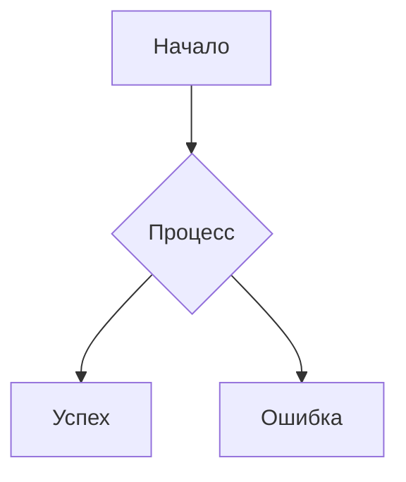

---
tags:
Создана: 2025-11-01
Номер ПЗ: "#1"
Тема ПЗ: Преобразовать черновик документа в документ с заданной структурой, используя средства автоматизации в приложении
---
# Excel
Научиться превращать неформатированный "черновик" текста или данных в четко организованную таблицу, используя встроенные средства автоматизации **Excel**.
Исходные данные
```text
Иванов Иван Сергеевич; менеджер; продажи; ivanov@mail.com; +7-900-123-45-67
Петрова Анна Викторовна; аналитик; маркетинг; petrova@company.com; +7-911-234-56-78
Сидоров Петр Алексеевич; разработчик; IT; sidorov.p@yandex.ru; 89162234567
```
**Ключевые навыки**:
- **Текст по столбцам**.
- **Функции для работы с текстом** (`ПОДСТАВИТЬ`, `СЖПРОБЕЛЫ`, ).
- **Условное форматирование и фильтры**.
## Самостоятельные задания через Гугл Таблицы
### №1
На данных ниже показываем заполнение формулами столбцы: **Итого за квартал** и **Среднее**.
```text
Менеджер;Январь;Февраль;Март
Иванов;120000;150000;110000
Петрова;95000;160000;140000
Сидоров;135000;135000;170000
```
Просим подсчитать **Итоги по месяцам**. Даем задачу: Найти сумму продаж Петровой за месяцы, где продажи были больше 100 000.
### №2
```text
Товар;Категория;Цена;Кол-во;Дата поступления
Стол письменный;Мебель;5000;10;01.02.2024
Стул офисный;Мебель;1500;25;15.01.2024
Монитор 24";Электроника;12000;5;10.02.2024
Клавиатура;Электроника;800;30;05.03.2024
```
Просим подсчитать Общую стоимость каждого товара и Определить, сколько дней товар находится на складе (`СЕГОДНЯ() - E2` или `РАЗНДАТ(E2; СЕГОДНЯ(); "d")`).
# MS Word
Научиться применять встроенные инструменты автоматизации текстового процессора (на примере **MS Word**) для придания неструктурированному тексту четкого, профессионального и единообразного формата.
**Ключевые навыки**:
- Работа со **Стилями**.
- Использование **Многоуровневого списка**.
- Создание **Автоматического оглавления**.
- Работа с **Настройками страницы**.
- Использование **колонтитулов** и **полей документа**.
**Ключевые выводы:**
- **Стили – это основа.** Они экономят время, обеспечивают единообразие и позволяют мгновенно менять оформление всего документа.
- **Оглавление, колонтитулы, номера страниц** – это не просто "красиво", это обязательные элементы официального документа, которые создаются автоматически
# Markdown
Представьте, что вам нужно быстро написать текст, который легко читается в исходном виде, но при этом его можно легко преобразовать в красиво оформленный HTML-документ (с заголовками, списками, жирным шрифтом). Именно для этого и был создан Markdown.
**Markdown** – это облегченный язык разметки с простым синтаксисом, предназначенный для создания форматированного текста с помощью обычного текстового редактора. Его главная философия – *быть максимально читабельным и простым в написании*.
**Почему он так популярен?**
- **Простота:** Синтаксис интуитивно понятен и запоминается за 5 минут.
- **Универсальность:** Его поддерживают миллионы приложений: GitHub, Notion, Discord, Telegram, многие редакторы кода (VS Code, Sublime Text) и CMS.
- **Текстовый формат:** Файлы `.md` можно открыть в любом редакторе, они легковесны и не зависят от конкретной операционной системы.
**Сфера применения:**
- Для **личных заметок** и построения базы знаний отлично подходят Obsidian или Typora.
- **Разработчикам**, работающим с кодом и документацией, – VS Code.
- Для **быстрого создания контента** и совместной работы в браузере – StackEdit или HackMD.

| Сфера применения                     | Примеры и инструменты                                                                                                                                                                                     |
| ------------------------------------ | --------------------------------------------------------------------------------------------------------------------------------------------------------------------------------------------------------- |
| **Веб-сайты и блоги**                | Статические генераторы сайтов (Jekyll), CMS (Ghost), редакторы для GitHub-страниц (JekyllPad)[](https://www.markdownguide.org/getting-started/)[](https://github.com/mundimark/awesome-markdown-editors). |
| **Документация и README-файлы**      | GitHub, GitLab[](https://github.com/artyomboyko/Markdown)[](https://www.markdownguide.org/getting-started/)[](https://dev.to/noureldineadel65/the-complete-guide-to-markdown-4ejh).                       |
| **Ведение заметок**                  | Obsidian, Simplenote, Notable, Bear, Joplin[](https://www.markdownguide.org/getting-started/).                                                                                                            |
| **Рабочие и личные документы**       | Написание писем, черновиков, заданий с экспортом в PDF/HTML (Typora, iA Writer)[](https://www.markdownguide.org/getting-started/)[](https://github.com/mundimark/awesome-markdown-editors).               |
| **Книги и самоиздание**              | Сервисы вроде Leanpub, которые преобразуют `.md`-файлы в EPUB, PDF[](https://www.markdownguide.org/getting-started/).                                                                                     |
| **Презентации**                      | Инструменты Remark, Cleaver, Marp, Deckset[](https://www.markdownguide.org/getting-started/).                                                                                                             |
| **Электронная почта и коммуникация** | Браузерное расширение Markdown Here для оформления писем[](https://www.markdownguide.org/getting-started/).                                                                                               |
| **Коллаборативные редакторы**        | Онлайн-сервисы HackMD, StackEdit[](https://github.com/mundimark/awesome-markdown-editors).                                                                                                                |
## Основные Элементы Форматирования
### 1. Заголовки (`#`)
Чтобы создать заголовок, просто поставьте знак решетки (`#`) в начале строки. Количество решеток определяет уровень заголовка (от 1 до 6, по аналогии с HTML `<h1>` - `<h6>`).
```markdown
# Заголовок первого уровня (самый крупный)
## Заголовок второго уровня
### Заголовок третьего уровня
#### Заголовок четвертого уровня
##### Заголовок пятого уровня
###### Заголовок шестого уровня
```
### 2. Выделение текста (`*` и `_`)
Эти символы используются для придания тексту **жирного** начертания или _курсива_.
**Курсив (`*` или `_`)** 
Один символ с каждой стороны текста.
```markdown
Это *текст курсивом*.
Это тоже _текст курсивом_.
```

**Жирный шрифт (`**` или `__`)**
Два символа с каждой стороны текста.
```markdown
Это **жирный текст**.
Это тоже __жирный текст__.
```

**Жирный курсив (`***` или `___`)**
```markdown
Это ***жирный текст курсивом***.
Это тоже ___жирный текст курсивом___.
```
### 3. Списки (`*`)
Markdown легко создает маркированные (ненумерованные) и нумерованные списки.
**Маркированный список (`*`, `-` или `+`)**
```markdown
*  Элемент 1
*  Элемент 2
  *  Вложенный элемент (добавьте 4 пробела или табуляцию)
*  Элемент 3
```

**Нумерованный список (цифры с точкой)**
```markdown
1. Первый пункт
2. Второй пункт
3. Третий пункт
```
### 4. Ссылки
**Базовая ссылка:**
```markdown
[Яндекс Дзен](https://dzen.ru/)
```

**Ссылка с title (всплывающей подсказкой):**
```markdown
[Яндекс Дзен](https://dzen.ru/ "Здесь ваша подсказка")
```

**Ссылки-сноски:**
```markdown
Это [пример][1] ссылки-сноски.
А это [второй пример][2].

[1]: https://example.com/1
[2]: https://example.com/2 "Всплывающая подсказка"
```

**Автоссылки:**
```markdown
<https://example.com>
<email@example.com>
```
### 5. Изображения
Синтаксис похож на ссылки, но с `!`.
**Базовое изображение:**
```markdown

```

**Изображение с размером (HTML):**
```markdown

```
### 6. Работа с кодом
**Встроенный код (inline code):**
```markdown
Для вывода текста используйте `console.log()`
```

**Блоки кода (code blocks):**
```javascript
function hello() {
  console.log("Hello World!");
}
```

```python
def hello():
  print("Hello World!")
```

```bash
npm install package
```
### 7. Таблицы
Один из самых мощных инструментов Markdown
```Markdown
| Заголовок 1 | Заголовок 2 | Заголовок 3 |
|-------------|-------------|-------------|
| Ячейка 1  | Ячейка 2  | Ячейка 3  |
| Ячейка 4  | Ячейка 5  | Ячейка 6  |
```

**Выравнивание столбцов:**
```Markdown
| Left | Center | Right |
|:-----|:------:|------:|
| текст текст| текст текст | текст текст |
```
### 8. Цитаты (Blockquotes)
```markdown
> Это основная цитата
> 
> Она может содержать несколько абзацев
> 
> > И даже вложенные цитаты
> 
> И **другие** элементы *форматирования*
```
### 9. Горизонтальные разделители

```markdown
Текст выше разделителя

---

Текст между разделителями

***

Текст ниже разделителя
```
### 10. HTML в Markdown
```markdown
Это **Markdown**, а ниже HTML:

<details>
<summary>Нажмите для раскрытия</summary>
Это скрытый контент!
</details>

<kbd>Ctrl + C</kbd> - сочетание клавиш
```
### 11. Зачеркивание
```markdown
~~Этот текст будет зачеркнут~~
```
### 12. Списки задач (Task Lists)
```markdown
- [x] Выполненная задача
- [ ] Невыполненная задача
- [ ] Еще одна задача
```
### 13. Экранирование символов
```markdown
\*Это не курсив\*
\# Это не заголовок
\[Это не ссылка\]\(example.com\)
```
### 14. Математические формулы (в некоторых редакторах)
```markdown
Встроенная формула: $E = mc^2$

Блочная формула:
$$
\sum_{i=1}^n i = \frac{n(n+1)}{2}
$$
```
### 15. Диаграммы Mermaid (расширенная функция)
```markdown

\`\`\`mermaid
graph TD
  A[Начало] --> B{Процесс}
  B --> C[Успех]
  B --> D[Ошибка]
\`\`\`

```



# Python
Python представляет популярный высокоуровневый язык программирования, который предназначен для создания приложений различных типов. Это и веб-приложения, и игры, и настольные программы, и работа с базами данных. Довольно большое распространение питон получил в области машинного обучения и исследований искусственного интеллекта.
Впервые язык Python был анонсирован в 1991 году голландским разработчиком Гвидо Ван Россумом. С тех пор данный язык проделал большой путь развития. В 2000 году была издана версия 2.0, а в 2008 году - версия 3.0. Несмотря на вроде такие большие промежутки между версиями постоянно выходят подверсии. Так, текущей актуальной версией является 3.14.0, которая вышла 07 октября 2025 года.
## *Основные особенности Python*
### *Простота и читаемость*
- Минималистичный синтаксис (меньше "лишнего" кода по сравнению с C++, Java).
- Использует отступы (пробелы или табы) вместо фигурных скобок `{}`.
### *Интерпретируемый язык*
- Код выполняется построчно через интерпретатор (не требует компиляции, как C++).
- Можно запускать в интерактивном режиме (REPL).
### *Динамическая типизация*
- Типы переменных определяются автоматически.
- Не нужно явно указывать `int`, `string` и т. д.
### *Кроссплатформенность*
- Работает на Windows, macOS, Linux.
- Один и тот же код можно запускать везде.
### *Большая стандартная библиотека*
- Модули для работы с файлами (`os`, `shutil`), сетями (`socket`, `http`), математикой (`math`), датами (`datetime`) и многое другое.
### *Поддержка ООП и функционального программирования*
- Классы, наследование, полиморфизм.
- Лямбда-функции, генераторы, декораторы.
### *Автоматическое управление памятью (сборка мусора)*
- Не нужно вручную освобождать память (как в C/C++).
## *Для чего используется Python?*
- Веб-разработка (`Django`, `Flask`, `FastAPI`)
- Наука и анализ данных (`NumPy`, `Pandas`, `Matplotlib`)
- Машинное обучение и ИИ (`TensorFlow`, `PyTorch`, `scikit-learn`)
- Автоматизация и скрипты
- Разработка игр (`Pygame`)
- Парсинг и работа с API (`BeautifulSoup`, `Requests`)
- DevOps и системное администрирование (`Ansible`, `Docker`)
## PEP
**PEP (Python Enhancement Proposal)** – это официальные документы, которые предлагают новые функции, стандарты или важные изменения в Python. Они тесно связаны с развитием языка и принимаются сообществом после обсуждения.
**PEP – это «конституция» Python:**
- Описывают **новые возможности** (например, `:=` оператор из **PEP 572**)
- Фиксируют **стандарты кода** (**[[PEP 8]]** – стиль написания кода).
- Объясняют **принципы дизайна** языка (**[[PEP 20]]** – «Дзен Python»).
```python
# PEP 20
import this
```
## Установка
**Windows и Mac OS**
Для установки необходимо установить интерпретатор. Желаемую версию можно скачать с официального [сайта](https://www.python.org/downloads/).

**Linux**
D некоторых дистрибутивах Linux (например, в Ubuntu) Python может быть установлен по умолчанию. Для проверки версии Python в терминале надо выполнить `python3 --version`.
Для установки желаемой версии необходимо выполнить команду `sudo apt-get install python3.12`.
## Введение в написание программ
Программа на языке Python состоит из набора инструкций. Каждая инструкция помещается на новую строку.
```python
print(2 + 3)
print("Hello")
```
Большую роль в Python играют отступы. Неправильно поставленный отступ фактически является ошибкой. Например, в следующем случае мы получим ошибку, хотя код будет практически аналогичен приведенному выше:
```python
print(2 + 3)
	print("Hello")
```
Однако стоит учитывать, что некоторые конструкции языка могут состоять из нескольких строк. Например, условная конструкция if:
```python
if 1 < 2:
	print("Hello")
```
В данном случае если 1 меньше 2, то выводится строка "Hello". И здесь уже должен быть отступ, так как инструкция print("Hello") используется не сама по себе, а как часть условной конструкции if.
### Регистрозависимость
Python - регистрозависимый язык, поэтому выражения `print` и `Print` или `PRINT` представляют разные выражения. И если вместо метода `print` для вывода на консоль мы попробуем использовать метод `Print`, то получим ошибку.
```python
Print("Hello World")
```
### Комментарии
Для отметки, что делает тот или иной участок кода, применяются комментарии. При трансляции и выполнении программы интерпретатор игнорирует комментарии, поэтому они не оказывают никакого влияния на работу программы. Комментарии в Python бывают блочные и строчные.
Строчные комментарии предваряются знаком решетки - `#`. Они могут располагаться на отдельной строке.
```python
# Вывод на консоль
# сообщения Hello World
print("Hello World")
```
Любой набор символов после знака `#` представляет комментарий. То есть в примере выше первые две строки кода являются комментариями.
Также они могут располагаться на той же строке, что и инструкции языка, после выполняемых инструкций.
```python
print("Hello World") # Вывод сообщения в консоль
```
В блочных комментариях до и после текста комментария ставятся три одинарные кавычки: `'''текст комментария'''`.
```python
\`\`\`
  `Вывод на консоль`

  `сообщения Hello World`
\`\`\`
print("Hello World")
```
### Переменные
Посмотрим на представленный код.
```python
message = "Hello Python World!"
print(message)
```
В программу добавилась переменная с именем `message`. В каждой переменной хранится значение, то есть данные, связанные с переменной. В нашем случае значением является текст `"Hello Python world!"`.
Название переменной в Python должно начинаться с алфавитного символа или со знака подчеркивания и может содержать алфавитно-цифровые символы и знак подчеркивания. И кроме того, название переменной не должно совпадать с названием ключевых слов языка Python. Ключевых слов не так много, их легко запомнить.

| False | await  | else  | import  | pass  |
| ------ | -------- | ------- | -------- | ------ |
| None  | break  | except | in    | raise |
| True  | class  | finally | is    | return |
| and  | continue | for   | lambda  | try  |
| as   | def   | from  | nonlocal | while |
| assert | del   | global | not   | with  |
| async | elif   | if   | or    | yield |
В Python применяется два типа наименования переменных: **camel case** и **underscore notation**.
**Camel case** подразумевает, что каждое новое подслово в наименовании переменной начинается с большой буквы.
```python
userName = "Tom"
```
**Underscore notation** подразумевает, что подслова в наименовании переменной разделяются знаком подчеркивания.
```python
user_name = "Tom"
```
Отличительной особенностью переменной является то, что мы можем менять ее значение в течение работы программы.
```python
name = "Tom"
print(name)

name = "Bob"
print(name)
```

**Множественное присваивание**
В одной строке программы можно присвоить значения сразу нескольким переменным. Этот синтаксис сократит длину программы и упростит ее чтение; чаще всего он применяется при инициализации наборов чисел.
Например, следующая строка инициализирует переменные `x`, `y` и `z`.
```python
x, y, z = 0, 1, 2
print(f'{x = }')
print(f'{y = }')
print(f'{z = }')
```

**Константы**
Константа представляет собой переменную, значение которой остается неизменным на протяжении всего срока жизни программы. В Python нет встроенных типов констант, но у программистов Python принято записывать имена переменных, которые должны рассматриваться как константы и оставаться неизменными, буквами верхнего регистра.
```python
MAX_CONNECTIONS = 5000
```
### Типы данных
#### Простые типы
Числа очень часто применяются в программировании для ведения счета в играх, представления данных в визуализациях, хранения информации в веб-приложениях и т.д. В Python числовые данные делятся на несколько категорий в соответствии со способом их использования.
##### Целые числа - `int`
В Python с целыми числами можно выполнять операции сложения (`+`), вычитания (`-`), умножения (`*`), деления (`/`) и возведения в степень (`**`).
```python
print(f'{2 + 3 = }')
print(f'{2 - 3 = }')
print(f'{2 * 3 = }')
print(f'{3 / 2 = }')
print(f'{3 ** 3 = }')
```
В Python также существует определенный порядок операций, что позволяет использовать несколько операций в одном выражении. Круглые скобки используются для изменения следования операций, чтобы выражение могло вычисляться в нужном порядке.
```python
print(f'{2 + 3 * 4 = }')
print(f'{(2 + 3) * 4 = }')
```
##### Вещественные числа - `float`
В Python числа, имеющие дробную часть, называются вещественными (или «числами с плавающей точкой»).
```python
print(f'{0.1 + 0.1 = }')
print(f'{0.2 + 0.2 = }')
print(f'{2 * 0.1 = }')
print(f'{2 * 0.2 = }')
```
Однако в некоторых ситуациях вдруг оказывается, что результат содержит неожиданно большое количество разрядов в дробной части.
```python
print(f'{0.2 + 0.1 = }')
print(f'{3 * 0.1 = }')
```
Нечто подобное может произойти в любом языке; для беспокойства нет причин. Python пытается подобрать как можно более точное представление результата, что иногда бывает нелегко из-за особенностей внутреннего представления чисел в компьютерах. Пока просто не обращайте внимания на «лишние» разряды.
##### Целые и вещественные числа
При делении двух любых чисел – даже если это целые числа, частным от деления которых является целое число, – вы всегда получаете вещественное число. При смешении целого и вещественного числа в любой другой операции вы также получаете вещественное число.
```python
print(f'{4 / 2 = }')
print(f'{1 + 2.0 = }')
print(f'{2 * 3.0 = }')
print(f'{3.0 ** 2 = }')
```
Python по умолчанию использует вещественный тип для результата любой операции, в которой задействовано вещественное число, даже если результат является целым числом.
##### Комплексные числа - `complex`
Python поддерживает работу с комплексными числами.
```python
comp = 3 + 4j
print(comp.real) # 3.0
print(comp.imag) # 4.0
```
И также поддерживает операции над комплексными числами.
```python
comp_1 = 3 + 4j
comp_2 = 2 + 5j
print(f'{comp_1 + comp_2 = }')
print(f'{comp_1 - comp_2 = }')
print(f'{comp_1 * comp_2 = }')
print(f'{comp_1 / comp_2 = }')
```
##### Символы подчеркивания в числах
В записи целых чисел можно группировать цифры при помощи символов подчеркивания, чтобы числа лучше читались.
```python
universe_age = 14_000_000_000
print(universe_age)
```
Python игнорирует символы подчеркивания при хранении таких значений. Даже если цифры не группируются в тройках, это никак не повлияет на значение. С точки зрения Python `1000` ничем не отличается от записи `1_000`, которая эквивалентна `10_00`.
```python
1000 == 1_000 == 10_00
```
##### Логический тип - `bool`
```python
is_active = True
is_deleted = False
print(f'{10 > 5: }')
print(f'{10 == 5: }')
```
##### Пустой тип - `NoneType`
```python
result = None
print(type(result))
```
##### Строки - `str`
Строка представляет собой простую последовательность символов. Любая последовательность символов, заключенная в кавычки, в Python считается строкой; при этом строки могут быть заключены как в одиночные, так и в двойные кавычки.
```python
print('Это строка')
print("И это тоже строка")
```
Это правило позволяет использовать внутренние кавычки и апострофы внутри строк.
```python
print('Я всегда говорю, что "Питон мой `любимый` язык"')
```
###### Изменение регистра символов в строках
Одна из простейших операций, выполняемых со строками, – изменение регистра символов. 
```python
name = "иванов иван иванович"
print(f'{name.title() = }')
```
В этом примере в переменной name сохраняется строка, состоящая из букв нижнего регистра. За именем переменной в команде `print()` следует вызов метода` title()`. Метод представляет собой действие, которое Python выполняет с данными. Точка (`.`) после `name` в конструкции `name.title()` приказывает Python применить метод `title()` к переменной `name`. За именем метода всегда следует пара круглых скобок, потому что методам для выполнения их работы часто требуется дополнительные параметры. Они указываются в скобках. Функции `title()` дополнительные параметры не нужны, поэтому в круглых скобках ничего нет.
Метод `title()` преобразует первый символ каждого слова в строке к верхнему регистру, тогда как все остальные символы выводятся в нижнем регистре.
Для работы с регистром также существуют другие полезные методы. Например, все символы строки можно преобразовать к верхнему (`upper()`) или нижнему регистру (`lower()`).
Также можно использовать метод `capitalize()` для перевода первого символа в верхний регистр. Или `swapcase()` для изменения регистров на обратные.
```python
name = "Иванов Иван Иванович"
print(f'Переводим в верхний регистр: {name.upper()}')
print(f'Переводим в нижний регистр: {name.lower()}')
print(f'Меняем регистры на противоположные: {name.swapcase()}')
print(f"{'иванов иван иванович'.capitalize() = }")
```
###### Поиск и замена
Метод `find()` возвращает индекс **первого** совпадения подстроки в строке. Если не указан индекс, то, по умолчанию, возвращается индекс первого совпадения. Если совпадения не найдены, возвращается `-1`.  Аналогично, работает метод `rfind()`. Только он возвращается индекс **последнего** совпадения. 
```python
example_text = "hello world hello"

print(f"{example_text.find('hello') = }")
print(f"{example_text.find('hello', 1) = }")
print(f"{example_text.rfind('hello') = }")
print(f"{example_text.find('python') = }")
```
Метод `replace()` вернет копию строки, в которой все вхождения искомой подстроки заменены на новую подстроку. Если значение параметра `count` не указано или равно `-1`, то заменяются все вхождения. Если указан, то заменяются только указанное количество вхождений.
```python
example_text = "hello world hello"

print(f"{example_text.find('hello') = }")
print(f"{example_text.find('hello', 1) = }")
print(f"{example_text.rfind('hello') = }")
print(f"{example_text.find('python') = }\n")

print(f"{example_text.replace('hello', 'hi') = }")
print(f"{example_text.replace('hello', 'hi', 1) = }")
```
###### Проверка содержимого
Строки предоставляют большое количество инструментов для проверки исходной строки на различные содержания.
Метод `isalpha()` возвращает `True`, если все символы в строке `str` являются буквенными и есть хотя бы один символ (строка не пустая и не состоит из одного пробела), в противном случае `False`.
Метод `isdigit()` возвращает `True`, если все символы в строке являются цифрами и есть хотя бы один символ, в противном случае `False`.
Метод `isalnum()` возвращает `True`, если все символы в строке являются буквенно-цифровыми и есть хотя бы один символ, в противном случае `False`.
Метод `isspace()` возвращает `True`, если в строке есть только пробелы и если есть хотя бы один пробел, в противном случае `False`.
Метод `istitle()` возвращает `True`, если каждое слово в строке начинается с заглавной буквы и в ней есть хотя бы один символ в верхнем регистре. Возвращает `False` в противном случае.
Метод `isupper()` возвращает `True`, если все символы в строке прописные и есть хотя бы один символ в верхним регистре, в противном случае `False`.
Метод `islower()` возвращает `True`, если все символы в строке имеют нижний регистр и есть хотя бы один символ, в противном случае `False`.
Метод `startswith()` возвращает `True`, если строка начинается указанным префиксом `prefix`, в противном случае возвращает `False`.
Метод `endswith()` возвращает `True`, если строка заканчивается указанным суффиксом `suffix`, в противном случае возвращает `False`.
```python
print(f"{'hello'.isalpha() = }")
print(f"{'123'.isdigit() = }")
print(f"{'hello123'.isalnum() = }")
print(f"{'   '.isspace() = }")
print(f"{'Hello World'.istitle() = }")
print(f"{'HELLO'.isupper() = }")
print(f"{'hello'.islower() = }")

print(f"{'hello'.startswith('he') = }")
print(f"{'world'.endswith('rld') = }")
```
###### Разделение текста
Метод `split()` возвращает список слов в строке, используя параметр `sep` в качестве разделителя строки.
```python
example_text = "apple,banana,orange"
fruits = text.split(',')
print(f"{fruits = }")

print(f"{'Hello World Python'.split() = }")
print(f"{'one two three four'.split(' ', 2) = }")
```
###### `f-string`
`f-string` – это современный и мощный способ форматирования строк, появившийся в Python 3.6. Буква *f* происходит от слова *«format»*, потому что Python форматирует строку, заменяя имена переменных в фигурных скобках их значениями. С `f-string` можно сделать много интересного.
Как вы уже видели раньше, `f-string` умеют исполнять и выводить результат выражений внутри `{}`.
```python
a, b = 10, 3

print(f"Сумма: {a + b}")
print(f"Разность: {a - b}")
print(f"Сравнение: {a > b}")
print(f"Вызов метода: {'hello'.upper()}")
```
Точно также она умеет исполнять функции и выводить значения. Функции мы рассмотрим позже.
```python
def square(x):
  return x * x

print(f"Квадрат числа: {square(5)}")
print(f"Квадрат числа: {square(32)}")
```
Но самое главное, за что любят `f-strin` – это форматирование чисел и текста.
```python
# Целые числа
number = 42

print(f"Обычное: {number}")
print(f"С заполнением: {number:05d}")
print(f"С разделителем: {1000000:,}")
print(f"В двоичной: {number:b}")
print(f"В шестнадцатеричной: {number:X}")
```

```python
# Дробные числа
pi = 3.14159265

print(f"Обычное: {pi}")
print(f"2 знака: {pi:.2f}")
print(f"Процент: {0.75:.1%}")
print(f"Научная нотация: {1000:.2e}")
```

```python
# Выравнивание текста
text = "Python"
number = 42

print(f'|{text:<10}|')  # |Python  | - по левому краю
print(f'|{text:>10}|')  # |  Python| - по правому краю 
print(f'|{text:^10}|')  # | Python | - по центру
print(f'|{number:>10d}|') # |    42| - числа тоже можно выравнивать
```

```python
# Выравнивание текста c заполением
text = "Python"

print(f'|{text:*<10}|')
print(f'|{text:->10}|')
print(f'|{text:=^10}|')
```
###### Табуляции и разрывы строк
В программировании термином пропуск (whitespace) называются такие непечатаемые символы, как пробелы, табуляции и символы конца строки. Пропуски структурируют текст, чтобы пользователю было удобнее читать его.
Для включения в текст **табуляции** используется комбинация символов `\t`.
```python
print(f'Python')
print(f'\tPython')
```
**Разрывы** строк добавляются с помощью комбинации символов `\n`.
```python
print("Languages:\nPython\nC\nJavaScript")
```
Табуляции и разрывы строк могут сочетаться в тексте. Скажем, последовательность `\n\t` приказывает Python начать текст с новой строки, в начале которой располагается табуляция.
```python
print("Languages:\n\tPython\n\tC\n\tJavaScript")
```
###### Удаление пропусков
Лишние пропуски могут вызвать путаницу в программах. Для программиста строки `'python'` и `'python '` внешне неотличимы, но для программы это совершенно разные строки. Python видит лишний пробел в `'python '` и считает, что он действительно важен – до тех пор, пока вы не сообщите о противоположном.
Обращайте внимание на пропуски, потому что в программах часто приходится сравнивать строки, чтобы проверить на совпадение их содержимое. Типичный пример – проверка имен пользователей при входе на сайт. Лишние пропуски могут создавать путаницу и в более простых ситуациях. К счастью, Python позволяет легко удалить лишние пропуски из данных, введенных пользователем.
Python может искать лишние пропуски у левого и правого края строки. Чтобы убедиться в том, что у правого края (в конце) строки нет пропусков, вызовите метод `rstrip()`. Пропуски также можно удалить у левого края (в начале) строки при помощи метода `lstrip()`, а метод `strip()` удаляет пропуски с обоих концов.
```python
example_text = ' python '
print(f'Исходный текст: _{example_text}_')
print(f'Текст без пробелов справа: _{example_text.rstrip()}_')
print(f'Текст без пробелов слева: _{example_text.lstrip()}_')
print(f'Текст без пробелов: _{example_text.strip()}_')

example_text = '***hello***'
print(f"{example_text.strip('*') = }")
print(f"{example_text.lstrip('*') = }")
print(f"{example_text.rstrip('*') = }")
```
###### Доступ к символам
```python
example_text = 'Python'
print(f'{example_text[0] = }')
print(f'{example_text[2] = }')
print(f'{example_text[-1] = }')
print(f'{example_text[-2] = }')
```
###### Срезы - `slice`
Чтобы создать cрезы на основе строки, следует задать индексы первого и последнего элементов, с которыми вы намереваетесь работать.
```python
example_text = 'Hello World'
print(f"{' '.join(f'{v:<4}' for v in example_text)}")
print(f"{' '.join(f'{i:<4}' for i in range(len(example_text)))}")

print(f'{example_text[0:5] = }')
print(f'{example_text[6:] = }')
print(f'{example_text[:5] = }')
print(f'{example_text[::2] = }')
print(f'{example_text[::-1] = }')
```
###### Конкатенация (объединение)
```python
str1 = "Hello"
str2 = "World"

result = str1 + " " + str2
print(f'{result = }')

print(f"{'Hi' * 3 = }")
```
###### Проверка наличия подстроки
Для проверки наличия элемента в списке используется ключевое слово `in`. В качестве результата мы получим `True` или `False`, в зависимости от наличия искомого значения в списке.
```python
example_text = "Hello World"

print(f"Hello в строке: {'Hello' in example_text}")
print(f"Python в строке: {'Python' in example_text}")
print(f"world в строке: {'world' in example_text}")
```
#### Коллекции (Структуры данных)
Список представляет собой набор элементов, следующих в определенном порядке. Вы можете создать список для хранения букв алфавита, цифр от 0 до 9 или имен всех членов вашей семьи. В список можно поместить любую информацию, причем данные в списке даже не обязаны быть как-то связаны друг с другом.
##### Списки - `list`
В языке Python список обозначается квадратными скобками (`[]`), а отдельные элементы списка разделяются запятыми.
```python
fruits = ["apple", "banana", "orange"]
numbers = [1, 2, 3, 4, 5]
mixed = [1, "hello", 3.14, True]

print(f'{fruits = }')
print(f'{numbers = }')
print(f'{mixed = }')
```
Списки представляют собой упорядоченные наборы данных, поэтому для обращения к любому элементу списка следует сообщить Python позицию (**индекс**) нужного элемента. Чтобы обратиться к элементу в списке, укажите имя списка, за которым следует индекс элемента в квадратных скобках.
```python
print(f'{fruits[0] = }')
print(f'{numbers[1] = }')
print(f'{mixed[2] = }')
```
Заметьте, что первый элемент списка находится в позиции `0`, а не в позиции `1`. Этот принцип встречается в большинстве языков программирования и объясняется особенностями низкоуровневой реализации операций со списками. Если вы получаете неожиданные результаты, определите, не допустили ли вы простую ошибку **«смещения на 1»**.

В Python также существует специальный синтаксис для обращения к последнему элементу списка. Если запросить элемент с индексом `–1`, Python всегда возвращает последний элемент в списке.
Этот синтаксис весьма полезен, потому что при работе со списками часто требуется обратиться к последним элементам, не зная точного количества элементов в списке. Синтаксис также распространяется на другие отрицательные значения индексов. Индекс `–2` возвращает второй элемент от конца списка, индекс `–3` – третий элемент от конца, и т. д.
```python
print(f'{fruits[-1] = }')
print(f'{numbers[-2] = }')
print(f'{mixed[-3] = }')
```

###### Изменение, добавление и удаление элементов
Как правило, вы будете создавать динамические списки; это означает, что во время выполнения программы в созданном вами списке будут добавляться и удаляться элементы.
Синтаксис **изменения** элемента напоминает синтаксис обращения к элементу списка. Чтобы изменить элемент, укажите имя списка и индекс изменяемого элемента в квадратных скобках; далее задайте новое значение, которое должно быть присвоено элементу.
```python
print(f'Изначальный список: {fruits}')
fruits[0] = "kiwi"
print(f'Измененный список: {fruits}')
```
Изменить можно значение любого элемента в списке, не только первого.

Простейший способ **добавления** новых элементов в список – присоединение элемента в конец списка. Метод `append()` присоединяет строку `"grape"` в конец списка, другие элементы в списке при этом остаются неизменными.
```python
print(f'Изначальный список: {fruits}')
fruits.append("grape")
print(f'Измененный список: {fruits}')
```
Метод `append()` упрощает динамическое построение списков. Например, вы можете начать с пустого списка и добавлять в него элементы серией команд `append()`. В следующем примере в пустой список добавляются элементы `'honda'`, `'yamaha'` и `'suzuki'`.
```python
motorcycles = []
motorcycles = list()
print(f'Изначальный список: {motorcycles}')

motorcycles.append('honda')
motorcycles.append('yamaha')
motorcycles.append('suzuki')

print(f'Измененный список: {motorcycles}')
```
Такой способ построения списков встречается очень часто, потому что данные, которые пользователь захочет сохранить в программе, часто становятся известными только после запуска программы.

Метод `insert()` позволяет **добавить** новый элемент в произвольную позицию списка. Добавим значение `'ducati'` в начало списка. Метод `insert()` выделяет свободное место в позиции `0` и сохраняет в нем значение `'ducati'`. Все остальные значения списка при этом сдвигаются на одну позицию вправо.
```python
print(f'Изначальный список: {motorcycles}')
motorcycles.insert(0, 'ducati')
print(f'Измененный список: {motorcycles}')
```

Нередко возникает необходимость в **удалении** одного или нескольких элементов из списка. Элементы удаляются из списка по позиции или по значению. Если вам известна позиция элемента, который должен быть удален из списка, воспользуйтесь командой `del`. Вызов `del` удаляет второй элемент (c индексом `1`) `'honda'`, из списка `motorcycles`.
```python
print(f'Изначальный список: {motorcycles}')
del motorcycles[1]
print(f'Измененный список: {motorcycles}')
```
Иногда значение, удаляемое из списка, должно как-то использоваться. Метод `pop()` **извлекает** последний элемент из списка и позволяет работать с ним после удаления. Удалим последний мотоцикл из списка.
```python
print(f'Изначальный список: {motorcycles}')
popped_item = motorcycles.pop()
print(f'Измененный список: {motorcycles}')
print(f'Извлеченный: {popped_item}')
```
Вызов `pop()` может использоваться для **извлечения** элемента c произвольной позиции списка. Для этого следует указать индекс удаляемого элемента в круглых скобках.
```python
motorcycles = ['ducati', 'honda', 'yamaha', 'suzuki']
print(f'Изначальный список: {motorcycles}')

popped_item = motorcycles.pop(2)
print(f'Измененный список: {motorcycles}')
print(f'Извлеченный: {popped_item}')
```
Иногда позиция удаляемого элемента неизвестна. Если вы знаете только значение элемента, используйте метод `remove()`. Допустим, из списка нужно удалить значение `'yamaha'`.
```python
motorcycles = ['ducati', 'honda', 'yamaha', 'suzuki']
print(f'Изначальный список: {motorcycles}')
motorcycles.remove('yamaha')
print(f'Измененный список: {motorcycles}')
```
Метод `remove()` удаляет только первое вхождение заданного значения.
```python
motorcycles = ['ducati', 'honda', 'yamaha', 'suzuki', 'yamaha']
print(f'Изначальный список: {motorcycles}')
motorcycles.remove('yamaha')
print(f'Измененный список: {motorcycles}')
```
###### Сортировка списка методом `sort()`
Нередко список создается в непредсказуемом порядке, потому что порядок получения данных от пользователя не всегда находится под вашим контролем. И хотя во многих случаях такое положение дел неизбежно, часто требуется вывести информацию в определенном порядке. В одних случаях требуется сохранить исходный порядок элементов в списке, в других исходный порядок должен быть изменен.
Метод `sort()` позволяет относительно легко отсортировать список. Предположим, имеется список машин и вы хотите переупорядочить эти элементы по алфавиту. Чтобы упростить задачу, предположим, что все значения в списке состоят из символов нижнего регистра.
```python
cars = ['bmw', 'audi', 'toyota', 'subaru']
print(f'Изначальный список: {cars}')

cars.sort()
print(f'Отсортированный список: {cars}')
```
Список также можно отсортировать в обратном алфавитном порядке; для этого методу `sort()` следует передать аргумент `reverse=True`.
```python
cars = ['bmw', 'audi', 'toyota', 'subaru']
print(f'Изначальный список: {cars}')

cars.sort(reverse=True)
print(f'Отсортированный список: {cars}')
```
###### Временная сортировка списка функцией `sorted()`
Чтобы сохранить исходный порядок элементов списка, но временно представить их в отсортированном порядке, можно воспользоваться функцией `sorted()`. Функция `sorted()` позволяет представить список в определенном порядке, но не изменяет фактический порядок элементов в списке.
```python
cars = ['bmw', 'audi', 'toyota', 'subaru']
print(f'Изначальный список: {cars}')
print(f'Временно отсортированный список: {sorted(cars)}')
print(f'Список: {cars}')
```

Обратите внимание, что метод `sort()` возвращает `None`, но сортирует исходный список, а функция `sorted()` возвращает упорядоченный список. На это важно обращать внимание при написании алгоритмов.
```python
cars = ['bmw', 'audi', 'toyota', 'subaru']
print(f'Изначальный список: {cars}\n')

sorted_cars = sorted(cars)
print(f'Временно отсортированный список: {sorted_cars}')
print(f'Исходный список после временной сортировки: {cars}\n')

sort_cars = cars.sort()
print(f'Отсортированный список: {sort_cars}')
print(f'Исходный список после сортировки: {cars}')
```
###### Вывод списка в обратном порядке
Чтобы переставить элементы списка в обратном порядке, используйте метод `reverse()`. Скажем, если список машин первоначально хранился в хронологическом порядке даты приобретения, элементы можно легко переупорядочить в обратном хронологическом порядке.
```python
cars = ['bmw', 'audi', 'toyota', 'subaru']
print(f'Изначальный список: {cars}')

cars.reverse()
print(f'Список в обратном порядке: {cars}')
```
Обратите внимание: метод `reverse()` не сортирует элементы в обратном алфавитном порядке, а просто переходит к обратному порядку списка.
Если необходимо временно переставить элемента списка в обратном порядке, используйте слайсинг (`sliced`).
```python
cars = ['bmw', 'audi', 'toyota', 'subaru']
print(f'Изначальный список: {cars}')
print(f'Временный список в обратном порядке: {cars[::-1]}')
print(f'Список: {cars}')
```
###### Определение длины списка
Вы можете быстро определить длину списка с помощью функции `len()`. Список в нашем примере состоит из четырех элементов, поэтому его длина равна `4`.
```python
cars = ['bmw', 'audi', 'toyota', 'subaru']
print(f'Изначальный список: {cars}')
print(f'Длина списка: {len(cars)}')
```

`Какая длина у пустого списка []`
```python
empty_list = []
print(f'Изначальный список: {empty_list}')
print(f'Длина списка: {len(empty_list)}')
```
###### Ошибки индексирования при работе со списками
Когда программист только начинает работать со списками, он часто допускает одну характерную ошибку. Допустим, имеется список с тремя элементами и программа запрашивает `4` элемент.
```python
motorcycles = ['honda', 'yamaha', 'suzuki']
print(f'{motorcycles[3] = }')
```
Python пытается вернуть элемент с индексом `3`. Однако при поиске по списку ни один элемент motorcycles не обладает индексом `3`. Из-за смещения индексов на `1` эта ошибка весьма распространена. Люди думают, что третьим элементом является элемент с индексом `3`, потому что они начинают отсчет с `1`. Но для Python третьим является элемент с индексом `2`, потому что индексирование начинается с `0`.
Аналогичную ошибку можно получить, если попытаться получить элемент с индексом `-1` у пустого списка.
```python
empty_list = []
print(f'{empty_list[-1] = }')
```
###### Проверка наличия элемента
Для проверки наличия элемента в списке используется ключевое слово `in`. В качестве результата мы получим `True` или `False`, в зависимости от наличия искомого значения в списке.
```python
cars = ['bmw', 'audi', 'toyota', 'subaru']
print(f"bmw в списке: {'bmw' in cars}")
print(f"ferrari в списке: {'ferrari' in cars}")
```
##### Кортежи - `tuple`
Списки хорошо подходят для хранения наборов элементов, которые могут изменяться на протяжении жизненного цикла программы. Например, возможность модификации списков жизненно необходима при работе со списками пользователей сайта или списками персонажей игры. Однако в некоторых ситуациях требуется создать список элементов, который не может изменяться.
Кортеж – это **неизменяемая (immutable)** упорядоченная коллекция элементов. Элементы кортежа могут быть разных типов данных.
###### Создание кортежей
Кортеж выглядит как список, не считая того, что вместо квадратных скобок используются круглые скобки. 
```python
# Пустой кортеж

empty_tuple = ()
empty_tuple = tuple()
print(f'{empty_tuple = }')
```

```python
# Кортеж с одним элементом
# ОБЯЗАТЕЛЬНА запятая после элемента!

single_tuple = (5, )
print(f'{single_tuple = }')

not_a_tuple = (5)
print(type(single_tuple))
print(type(not_a_tuple))
```

```python
# Кортеж из нескольких элементов

coordinates = (100, 20)
colors = "red", "green", "blue"
mixed = (1, "hello", 3.14, True)

print(f'{coordinates = }')
print(f'{colors = }')
print(f'{mixed = }')
```
После определения кортежа вы можете обращаться к его отдельным элементам по индексам точно так же, как это делается при работе со списком.
```python
coordinates = (100, 20)
print(f'{coordinates[0] = }')
print(f'{coordinates[1] = }')
```

Посмотрим, что произойдет при попытке изменения одного из элементов в кортеже.
```python
coordinates = (100, 20)
coordinates[1] = 200
```
Код пытается изменить первое значение, но Python возвращает ошибку. По сути, так как мы пытаемся изменить кортеж, а эта операция недопустима для объектов этого типа, Python сообщает о невозможности присваивания нового значения элементу в кортеже.
###### Проверка наличия элемента
Проверка наличия элемента в кортеже осуществляется, по аналогии с списками.
```python
colors = ("red", "green", "blue")
print(f"red в кортеже: {'red' in colors}")
print(f"yellow в кортеже: {'yellow' in cars}")
```
###### Конкатенация (объединение)
```python
tuple1 = (1, 2, 3)
tuple2 = (4, 5, 6)

result = tuple1 + tuple2
print(f'{result = }')
```
###### Повторение
```python
base_tuple = ('a', 'b')
repeated = base_tuple * 3
print(f'{repeated = }')
```
###### Сравнение кортежей
```python
print(f'{(1, 2, 3) == (1, 2, 3) = }')
print(f'{(1, 2, 3) == (1, 2, 4) = }')
print(f'{(1, 2) < (1, 2, 3) = }')
print(f'{(1, 3) > (1, 2) = }')
```
###### Подсчет вхождения элемента - `count()`
```python
numbers = (1, 2, 3, 2, 4, 2, 5)
print(f'{numbers.count(2) = }')
print(f'{numbers.count(7) = }')
```
###### Поиск индекса элемента - `index()`
```python
fruits = ("apple", "banana", "orange", "banana", "grape")
print(f"{fruits.index('banana') = }")
print(f"{fruits.index('banana', 2) = }")
```
##### Словари - `dict`
**Словарь** в языке Python представляет собой совокупность пар **«ключ-значение»**. Каждый ключ связывается с некоторым значением, и программа может получить значение, связанное с заданным ключом. Значением может быть число, строка, список и даже другой словарь. Собственно, любой объект, создаваемый в программе Python, может стать значением в словаре.
В Python словарь заключается в фигурные скобки `{}`, в которых приводится последовательность пар **«ключ-значение»**. Количество пар «ключ-значение» в словаре не ограничено.
```python
# Пустой словарь
empty_dict = {}
empty_dict = dict()
print(f'{empty_dict = }')

# Способ 1: Фигурные скобки
person = {
    "name": "Эдуард",
    "age": 30,
    "city": "Москва",
}
print(f'{person = }')

# Способ 2: Функция dict()
person2 = dict(name="Иван", age=30, city="СПб")
print(f'{person2 = }')

# Способ 3: Из списка кортежей
pairs = [("name", "Мария"), ("age", 28)]
person3 = dict(pairs)
print(f'{person3 = }')
```
###### Обращение к значениям в словаре
Чтобы получить значение, связанное с ключом, укажите имя словаря, а затем ключ в квадратных скобках.
```python
person = {"name": "Анна", "age": 25, "city": "Москва"}

# Небезопасный способ
print(f"{person['name'] = }")
print(f"{person['age'] = }")
print(f"{person['email'] = }")

# Безопасный способ
print(f"{person.get('name') = }")
print(f"{person.get('email') = }")
print(f"{person.get('email', 'Нет данных') = }")
```
###### Добавление и изменение элементов
Словари относятся к динамическим структурам данных: в словарь можно в любой момент добавлять новые пары «ключ-значение». Для этого указывается имя словаря, за которым в квадратных скобках следует новый ключ с новым значением.
Чтобы изменить значение в словаре, укажите имя словаря с ключом в квадратных скобках, а затем новое значение, которое должно быть связано с этим ключом.
Обновить несколько пар  «ключ-значение» можно с помощью метода `update()`.
```python
person = {"name": "Анна", "age": 25, "city": "Москва"}
print(f"Словарь до добавления: {person}")

person["email"] = "anna@mail.ru"
print(f"Словарь после добавления: {person}")

person["age"] = 26
print(f"Словарь после изменения: {person}")

person.update(name='Иван', email="ivan@mail.ru")
print(f"Словарь после update: {person}")
```

`Что будет если добавить один и тот же ключ? Что мы получим в результате?`
```python
person = {
	"name": "Анна",
	"age": 25,
	"city": "Москва",
	"name": "Олег",
}
print(f"{person = }")
```
###### Удаление элементов
Когда информация, хранящаяся в словаре, перестает быть нужной, пару «ключ-значение» можно полностью удалить при помощи команды `del`. При вызове достаточно передать имя словаря и удаляемый ключ.
По аналоги с списками, элементы можно также удалять через метод `pop()`.
Так же весь словарь можно очистить с помощью метода `clear()`.
```python
person = {
	"name": "Анна",
	"age": 25,
	"city": "Москва",
	"email": "anna@mail.ru",
}
print(f"Изначальный словарь: {person}")

removed_value = person.pop("age")
print(f"Измененный словарь: {person}")
print(f"Удаленное значение: {removed_value}")

del person["name"]
print(f"Измененный через `del` словарь: {person}")

person.clear()
print(f"Словарь после очистки: {person}")
```
###### Проверка наличия ключа
```python
person = {
	"name": "Анна",
	"age": 25,
}
print(f"`name` в словаре: {'name' in person}")
print(f"`email` в словаре: {'email' in person}")
```
###### Длина словаря
```python
person = {
	"name": "Анна",
	"age": 25,
	"city": "Москва",
	"email": "anna@mail.ru",
}
print(f'{len(person) = }')
```
###### Перебор всех пар «ключ-значение»
```python
person = {
	"name": "Анна",
	"age": 25,
	"city": "Москва",
}

# Ключи
print(f'{person.keys() = }')

# Значения
print(f'{person.values() = }')

# Пары ключ-значение
print(f'{person.items() = }')
```
###### Объединение словарей
```python
dict1 = {"a": 1, "b": 2}
dict2 = {"c": 3, "d": 4}

# Способ 1: Оператор | (Python 3.9+)
merged = dict1 | dict2
print(f'{merged = }')

# Способ 2: Распаковка
merged = {**dict1, **dict2}
print(f'{merged = }')

# Способ 3: update()
merged = dict1.copy()
merged.update(dict2)
print(f'{merged = }')
```

`Что произойдет с значением, если при слиянии двух словарей у них есть одинаковый ключ?`
```python
dict1 = {"a": 1, "b": 2}
dict2 = {"b": 3, "d": 4}

print(f'{dict1 | dict2 = }')
print(f'{dict2 | dict1 = }')
```
###### Что может быть ключом?
```python
# Допустимые ключи (неизменяемые)
good_keys = {
    "string": "value1",
    123: "value2",
    (1, 2, 3): "value3",
    True: "value4",
    frozenset([1, 2]): "value5",
}

# НЕдопустимые ключи (изменяемые)
# bad_dict = {
#     [1, 2, 3]: "error",
#     {"a": 1}: "error",
#     {1, 2, 3}: "error",
# }
```
##### Множество - `set`
Множество – это **изменяемая** неупорядоченная коллекция **уникальных** элементов. Множества используются для хранения неповторяющихся данных и выполнения математических операций над множествами.
```python
# ВАЖНО: Пустые фигурные скобки создают словарь, а не множество!
empty_dict = {}
empty_set = set()

print(f'{type(empty_dict) = }')
print(f'{type(empty_set) = }\n')

numbers = {1, 2, 3, 4, 5}
fruits = {"apple", "banana", "orange"}
mixed = {1, "hello", 3.14, True}

print(f'{numbers = }')
print(f'{fruits = }')
print(f'{mixed = }\n')

# Из списка (удаляются дубликаты)
numbers_list = [1, 2, 2, 3, 3, 3, 4, 5]
unique_numbers = set(numbers_list)
print(f'{unique_numbers = }')

# Из строки
text = "hello"
chars_set = set(text)
print(f'{chars_set = }')

# Из кортежа
tuple_data = (1, 2, 2, 3)
set_from_tuple = set(tuple_data)
print(f'{set_from_tuple = }')
```
###### Неизменяемое множество `frozenset`
```python
# frozenset - неизменяемая версия множества
frozen = frozenset([1, 2, 3, 3, 4])

print(f'{frozen = }')
```
###### Добавление элементов
Добавление новых элементов осуществляется с помощью методов `add()`, если необходимо добавить один элемент, и `update()`, если необходимо добавить несколько значений.
```python
my_set = {1, 2, 3}

my_set.add(4)
my_set.add(2)
print(f'{my_set = }')

my_set.update([5, 6, 7])
my_set.update({8, 9}, [10, 11])
print(f'{my_set = }')
```
###### Удаление элементов
Для удаления элементов используется метод `remove()`. Но если в метод `remove()` передать значение, которого нет в множестве, то это вызовет исключение.
Чтобы избегать таких ошибок стоит использовать метод `discard()`.
```python
my_set = {1, 2, 3, 4, 5, 6}

my_set.remove(3)
print(f'{my_set = }')

my_set.discard(10)
my_set.discard(4)
print(f'{my_set = }')

element = my_set.pop()
print(f'Удален: {element}')
print(f'{my_set = }')

my_set.clear()
print(f'{my_set = }')
```
###### Проверка наличия элемента
```python
fruits = {"apple", "banana", "orange"}

print(f"`apple` в списке: {'apple' in fruits}")
print(f"`grape` в списке: {'grape' in grape}")
```
###### Длина множества
```python
numbers = {1, 2, 3, 4, 5}
print(f'{len(numbers) = }')
```
###### Объединение - `union`
```python
set_a = {1, 2, 3}
set_b = {3, 4, 5}

# Метод union()
union1 = set_a.union(set_b)
print(f'{union1 = }')

# Оператор |
union2 = set_a | set_b
print(f'{union2 = }\n')

# Объединение нескольких множеств
set_c = {5, 6, 7}
print(f'{set_a | set_b | set_c = }')
```

###### Пересечение - `intersection`
```python
set_a = {1, 2, 3, 4}
set_b = {3, 4, 5, 6}

# Метод intersection()
intersection1 = set_a.intersection(set_b)
print(f'{intersection1 = }')

# Оператор &
intersection2 = set_a & set_b
print(f'{intersection2 = }\n')
```
###### Разность - `difference`
```python
set_a = {1, 2, 3, 4, 5}
set_b = {4, 5, 6, 7}

# Элементы в A, но не в B
difference1 = set_a.difference(set_b)
difference2 = set_a - set_b
print(f'{difference1 = }')
print(f'{difference2 = }\n')

# Элементы в B, но не в A
difference3 = set_b - set_a
print(f'{difference3 = }')
```
###### Симметричная разность
```python
set_a = {1, 2, 3, 4}
set_b = {3, 4, 5, 6}

# Элементы, которые есть только в одном из множеств
sym_diff1 = set_a.symmetric_difference(set_b)
sym_diff2 = set_a ^ set_b

print(f'{sym_diff1 = }')
print(f'{sym_diff2 = }')
```
###### Проверка отношений между множествами
```python
set_a = {1, 2, 3}
set_b = {1, 2, 3, 4, 5}
set_c = {4, 5, 6}

# issubset() - является ли подмножеством
print(f'{set_a.issubset(set_b) = }')
print(f'{set_a <= set_b = }\n')

# issuperset() - является ли надмножеством
print(f'{set_a.issuperset(set_b) = }')
print(f'{set_b >= set_a = }\n')

# isdisjoint() - не имеют общих элементов
print(f'{set_a.isdisjoint(set_c) = }')
print(f'{set_b.isdisjoint(set_c) = }')
```
###### Что можно хранить в множествах
```python
valid_set = {
    1, 2, 3,
    "hello", "world",
    (1, 2, 3),
    frozenset([1, 2]),
}

# НЕдопустимые элементы
# invalid_set = {
#     [1, 2, 3],
#     {"a": 1},
#     {1, 2, 3},
# }
```
#### Другие типы данных
##### Бинарные
**`bytes`** - неизменяемая последовательность байт.
```python
data = b"hello"
```

**`bytearray`** - изменяемая последовательность байт
```python
mutable_data = bytearray(b"hello")
```
##### Специальные
###### Тип `range`
`range` – это неизменяемая последовательность чисел, часто используемая для циклов.
```python
r1 = range(5)
r2 = range(1, 6)
r3 = range(0, 10, 2)
r4 = range(10, 0, -1)

print(f'{r1 = }\n')

print(f'{list(r1) = }\n')
print(f'{list(r2) = }\n')
print(f'{list(r3) = }\n')
print(f'{list(r4) = }\n')
```
###### Тип `Exception`
Исключения – это специальные объекты, которые представляют ошибки и исключительные ситуации.
```text
BaseException
 ├── SystemExit
 ├── KeyboardInterrupt
 ├── GeneratorExit
 └── Exception
      ├── ArithmeticError
      │    ├── ZeroDivisionError
      │    ├── FloatingPointError
      │    └── OverflowError
      ├── LookupError
      │    ├── IndexError
      │    └── KeyError
      ├── OSError
      │    ├── FileNotFoundError
      │    ├── PermissionError
      │    └── ConnectionError
      ├── TypeError
      ├── ValueError
      ├── NameError
      ├── AttributeError
      └── ...
```
###### Тип `Ellipsis`
```python
ellipsis_obj = ...
print(f'{type(ellipsis_obj) = }')
```
### Циклы
В Python существует два основных типа циклов: **`for`** и **`while`**. Давайте подробно рассмотрим каждый из них.
##### Цикл `for`
Цикл `for` используется для итерации по последовательностям (списки, кортежи, строки, словари и т.д.).
```python
fruits = ["apple", "banana", "orange"]
for fruit in fruits:
    print(fruit)
```

```python
text = "Python"
for char in text:
    print(char)
```

```python
person = {"name": "Anna", "age": 25, "city": "Moscow"}

for key in person:
    print(f"Ключ: {key}")

for value in person.values():
    print(f"Значение: {value}")

for key, value in person.items():
    print(f"{key}: {value}")
```
##### Цикл с предусловием `while`
**Цикл с предусловием** - условие проверяется **ПЕРЕД** выполнением тела цикла. Например, простой счетчик.
```python
count = 1

while count <= 5:
    print(f"Итерация {count}")
    count += 1
```
Или код, который ждет пока сумма введенных чисел не станет больше 100.
```python
total = 0

while total < 100:
    number = int(input("Введите число: "))
    total += number
    print(f"Текущая сумма: {total}\n")

print(f"Итоговая сумма: {total}")
```
##### Управление циклами
Для управлением циклами существуют ключевые слова `break`, `continue`.
`break` - немедленный выход из цикла.
```python
for i in range(10):
    if i == 5:
        break
    print(f'for: {i}')

count = 0
while True:
    if count >= 5:
        break
    print(f'while: {count}')
    count += 1
```
`continue` - переход к следующей итерации.
```python
# Пропуск четных чисел
for i in range(10):
    if i % 2 == 0:
        continue
    print(f'Нечетное число: {i}')

# Пропуск определенных элементов
fruits = ["apple", "banana", "cherry", "date"]
for fruit in fruits:
    if fruit == "cherry":
        continue
    print(f'Не cherry: {fruit}')
```
### Команда if
Программисту часто приходится проверять наборы условий и принимать решения в зависимости от этих условий. Команда `if` в языке Python позволяет проверить текущее состояние программы и выбрать дальнейшие действия в зависимости от результатов проверки.
Допустим, у вас имеется список машин и вы хотите вывести название каждой машины. Названия большинства машин должны записываться с капитализацией (первая буква в верхнем регистре, остальные в нижнем). С другой стороны, значение *bmw* должно записываться в верхнем регистре. Следующий код перебирает список названий машин и ищет в нем значение *bmw*. Для всех элементов, содержащих значение *bmw*, значение выводится в верхнем регистре.
```python
cars = ['audi', 'bmw', 'subaru', 'toyota']

for car in cars:
	if car == 'bmw':
		print(car.upper())
	else:
		print(car.title())
```
В каждой команде `if` центральное место занимает выражение, результатом которого является логическая истина (`True`) или логическая ложь (`False`); это выражение называется условием. В зависимости от результата проверки Python решает, должен ли выполняться код в команде `if`. Если результат условия равен `True`, то Python выполняет код, следующий за командой `if`. Если же будет получен результат `False`, то Python игнорирует код, следующий за командой `if`.

Ключевое слово `or` позволяет проверить несколько условий, но результат общей проверки является **истинным** в том случае, когда истинно хотя бы одно из всех условий. **Ложный** результат достигается только в том случае, если все условия ложны.
```python
a = 20
b = 10

print(f'{a > 15 or b > 15 = }')
print(f'{a > 20 or b > 20 = }')
```
Ключевое слово `and` также позволяет проверить несколько условий, но результат общей проверки является **истинным** в том случае, когда каждое условие истинно. **Ложный** результат достигается в остальных случаях.
```python
a = 20
b = 10

print(f'{a > 15 and b > 15 = }')
print(f'{a > 5 and b > 5 = }')
```

Часто в программе необходимо выполнить одно действие в том случае, если условие истинно, и другое действие, если оно ложно. С синтаксисом `if-else` это возможно. Блок `if-else` в целом похож на команду `if`, но секция `else` определяет действие или набор действий, выполняемых при неудачной проверке.
Нередко в программе требуется проверять более двух возможных ситуаций; для таких ситуаций в Python предусмотрен синтаксис `if-elif-else`. Python выполняет только один блок в цепочке `if-elif-else`. Все условия проверяются по порядку до тех пор, пока одно из них не даст истинный результат. Далее выполняется код, следующий за этим условием, а все остальные проверки Python пропускает.
```python
a = 20

if a < 4:
	print(f'{a} < 4')
elif a > 30:
	print(f'{a} > 30')
else:
	print(f'Наши условия не выполнимы')
```
### Функции
**Функции** – именованные блоки кода, предназначенные для решения одной конкретной задачи. Чтобы выполнить задачу, определенную в виде функции, вы вызываете функцию, отвечающую за эту задачу. Если задача должна многократно выполняться в программе, вам не придется заново вводить весь необходимый код; просто вызовите функцию, предназначенную для решения задачи, и этот вызов прикажет Python выполнить код, содержащийся внутри функции. 
Функции – это один из ключевых функционалов, позволяющий Python выполнять принцип разработки программного обеспечения, называемый **DRY (Don't repeat yourself)** или "не повторяйся".

Давайте напишем и вызовем простейшую функцию `greet_user()`. 
```python
def greet_user():
	print("Hello!")
	
greet_user()
```
В этом примере представлена простейшая структура функции. При помощи ключевого слова `def` сообщает Python, что вы определяете функцию. В определении функции указывается имя функции и если нужно – параметры, необходимые функции для решения ее задачи. Эти параметры заключаются в круглые скобки. В данном примере функции присвоено имя `greet_user()` и она не нуждается в параметрах для решения своей задачи, поэтому круглые скобки пусты. Впрочем, даже в этом случае они обязательны. Наконец, определение завершается двоеточием.

Все строки с отступами, которые будут следовать за `def greet_user():`, образуют **тело** функции. Сейчас тело состоит всего из одной строки.
**Вызов** функции приказывает Python выполнить содержащийся в ней код. Чтобы вызвать функцию, укажите ее **имя**, за которым следуют параметры, заключенные в круглые скобки.
#### Передача параметров
С небольшими изменениями функция `greet_user()` сможет не только сказать `Hello!` пользователю, но и поприветствовать его по имени. Для этого следует включить имя `username` в круглых скобках в определении функции `def greet_ user()`.
```python
def greet_user(username):
	print(f"Hello, {username.title()}!")
	
greet_user('world')
```
С добавлением `username` функция примет любое значение, которое будет заключено в скобки при вызове. Теперь функция ожидает, что при каждом вызове будет передаваться имя пользователя.
Переменная `username` в определении `greet_user()` – **параметр**, то есть условные данные, необходимые функции для выполнения ее работы. Значение `world` в `greet_user('world')` – **аргумент**, то есть конкретная информация, переданная при вызове функции. Иногда в термины **аргумент** и **параметр** используются как синонимы.
#### Передача аргументов
Определение функции может иметь несколько параметров, и может оказаться, что при вызове функции должны передаваться несколько аргументов. Существуют несколько способов передачи аргументов функциям. **Позиционные аргументы** перечисляются в порядке, точно соответствующем порядку записи параметров; **именованные аргументы** состоят из имени переменной и значения; наконец, существуют списки и словари значений.
##### Позиционные аргументы
При вызове функции каждому аргументу должен быть поставлен в соответствие параметр в определении функции. Проще всего сделать это на основании порядка перечисления аргументов. Значения, связываемые с аргументами подобным образом, называются **позиционными аргументами**.
Чтобы понять, как работает эта схема, рассмотрим функцию для вывода информации о домашних животных.
```python
def describe_pet(animal_type, name_pet):
	print(f"My {animal_type}'s name is {name_pet.title()}")
	
describe_pet('dog', 'batman')
describe_pet('batman', 'dog')
```
Из определения видно, что функции должен передаваться тип животного (`animal_type`) и его имя (`name_pet`). При вызове `describe_pet()` необходимо передать тип и имя – именно в таком порядке.
Если нарушить порядок следования аргументов в вызове при использовании позиционных аргументов, возможны неожиданные результаты.
##### Именованные аргументы
**Именованный аргумент** представляет собой пару **«имя-значение»**, передаваемую функции. Имя и значение связываются с аргументом напрямую, так что при передаче аргумента путаница с порядком исключается.
Перепишем вызов функции `describe_pet()` с использованием именованных аргументов. Как можно заметить теперь вывод функции не изменяется.
```python
describe_pet(animal_type='dog', name_pet='Batman')
describe_pet(name_pet='Batman', animal_type='dog')
```
#### Значения по умолчанию
Для каждого параметра вашей функции можно определить значение по умолчанию. Если при вызове функции передается аргумент, соответствующий данному параметру, Python использует значение аргумента, а если нет – использует значение по умолчанию. Таким образом, если для параметра определено значение по умолчанию, вы можете опустить соответствующий аргумент, который обычно включается в вызов функции. Значения по умолчанию упрощают вызовы функций.
Например, допустим я заметил, что большинство вызовов `describe_pet()` используется для описания собак, поэтому установим `animal_type` значение по умолчанию `dog`.
```python
def describe_pet(name_pet, animal_type = 'dog'):
	print(f"My {animal_type}'s name is {name_pet.title()}")
	
describe_pet('batman')
describe_pet(name_pet='batman')
describe_pet('batman', 'cat')
```
Мы изменили определение `describe_pet()` и включили для параметра `animal_type` значение по умолчанию `dog`. Если теперь функция будет вызвана без указания `animal_type`, Python знает, что для этого параметра следует использовать значение `dog`.
**Обратите внимание**: в определении функции пришлось изменить порядок параметров. Так как благодаря значению по умолчанию указывать аргумент с типом животного не обязательно, единственным оставшимся аргументом в вызове функции остается имя домашнего животного. Python интерпретирует его как позиционный аргумент, и если функция вызывается только с именем животного, этот аргумент ставится в соответствие с первым параметром в определении функции. Именно по этой причине имя животного должно быть первым параметром.
#### Возвращаемое значение
Функция не обязана выводить результаты своей работы напрямую. Вместо этого она может обработать данные, а затем вернуть значение или набор сообщений. Значение, возвращаемое функцией, называется **возвращаемым значением**. Команда `return` передает значение из функции в точку программы, в которой эта функция была вызвана. Возвращаемые значения помогают переместить большую часть рутинной работы в вашей программе в функции, чтобы упростить основной код программы.
```python
def describe_pet(name_pet, animal_type = 'dog'):
	print(f"My {animal_type}'s name is {name_pet.title()}")
	return name_pet.title()
	
returned_value = describe_pet('batman')
print(f'{returned_value = }')
```
Функция может вернуть любое значение, которое вам потребуется, в том числе и более сложную структуру данных (например, список или словарь).
#### Хранение функций в модулях
Одно из преимуществ функций заключается в том, что они отделяют блоки кода от основной программы. Если для функций были выбраны содержательные имена, ваша программа будет намного проще читаться. Можно пойти еще дальше и сохранить функции в отдельном файле, называемом **модулем**, а затем **импортировать** модуль в свою программу. Команда `import` сообщает Python, что код модуля должен быть доступен в текущем выполняемом программном файле.
Хранение функций в отдельных файлах позволяет скрыть второстепенные детали кода и сосредоточиться на логике более высокого уровня. Кроме того, функции можно использовать во множестве разных программ. Функции, хранящиеся в отдельных файлах, можно передать другим программистам без распространения полного кода программы. А умение импортировать функции позволит вам использовать библиотеки функций, написанные другими программистами.

Чтобы заняться импортированием функций, сначала необходимо создать модуль. Модуль представляет собой файл с расширением `.py`, содержащий код, который вы хотите импортировать в свою программу.
Рассмотрим на примере встроенной библиотеки `math`. Библиотека `math` предоставляет математические функции и константы.
##### Полный импорт модуля
```python
import math

print(f'{math.pi = }')
print(f'{math.sqrt(25) = }')
```
##### Импорт с псевдонимом
```python
import math as m

print(f'{m.e = }')
print(f'{m.sin(m.pi / 2) = }')
```
##### Импорт конкретных функций
```python
from math import sqrt, pow, pi

print(f'{pi = }')
print(f'{sqrt(16) = }')
print(f'{pow(2, 3) = }')

print(f'{sin(pi / 2) = }')
```
##### Импорт всех функций
```python
from math import *

print(f'{cos(0) = }')
print(f'{tan(pi/4) = }')
print(f'{ceil(3.2) = }')
```
##### Импорт с псевдонимом для функции
```python
from math import factorial as fact, degrees as deg

print(f'{fact(4) = }')
print(f'{deg(pi) = }')
```
### Файлы
Гигантские объемы данных доступны в текстовых файлах. В них могут храниться погодные данные, социально-экономическая информация, литературные произведения и многое другое. Чтение из файла особенно актуально для приложений, предназначенных для анализа данных, но оно также может пригодиться в любой ситуации, требующей анализа или изменения информации, хранящейся в файле.
```text
Иван,25,Москва,инженер
Анна,30,Санкт-Петербург,дизайнер
Петр,22,Казань,студент
Мария,28,Новосибирск,менеджер
Алексей,35,Екатеринбург,разработчик
```
Для открытия и последующего корректного закрытия файла используется функция `open()` с ключевым словом `with`. В качестве основного параметра open принимает путь к файлу.
```python
with open('data.txt') as handler:
	text = handler.read()
```
По умолчанию, все файлы которые мы передаем в `open()` открываются в режиме `r` – **чтение**. Файлы можно открывать в режиме **чтения** (`r`), **записи** (`w`), **присоединения** (`a`) или в режиме, допускающем как чтение, так и запись в файл (`r+`).
Теперь рассмотрим как мы можем файл прочитать. После выполнения кода с `with` мы получаем переменную `handler` – файловый дескриптор. **Файловый дескриптор (File Descriptor)** – это самый технически корректный термин. Он отражает, что переменная является ссылкой на низкоуровневый ресурс операционной системы для работы с файлом. 
Сам же `handler` имеет следующие методы для чтения файла: `read()`, `readline()`, `readlines()`. И методы для записи: `write()`, `writelines()`.
```python
with open('data.txt', 'r') as handler:
	text = handler.read()

print(f'{text = }')

with open('data.txt', 'r') as handler:
	text2 = handler.read(10)

print(f'{text2 = }')
```

```python
with open('data.txt', 'r') as handler:
	text1 = handler.read(10)
	text2 = handler.read(10)

print(f'{text1 = }')
print(f'{text2 = }')
```

```python
with open('data.txt', 'r') as handler:
	text = handler.readline()

print(f'{text = }')
```

```python
with open('data.txt', 'r') as handler:
	text = handler.readlines()

print(f'{text = }')
```

```python
data = 'Hello, Python!'
with open('data_write.txt', 'w') as handler:
	text = handler.write(data)

print(f'{text = }')
```

```python
data = 'Hello, Python!'
with open('data_write.txt', 'w') as handler:
	handler.write(data)
	handler.write(data)
```

```python
data = ['Hello, Python!', 'Hello, World!']
with open('data_write.txt', 'w') as handler:
	handler.writelines(data)
```